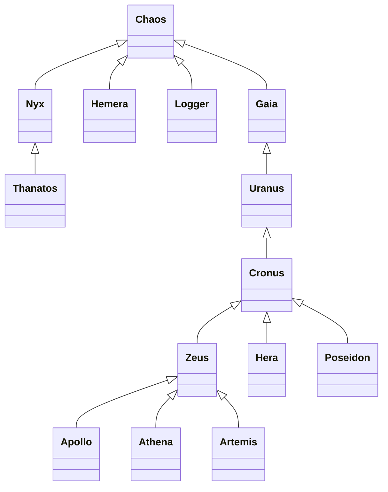

# Pantheon Game

A tick-based simulation game written in JavaScript and TypeScript based on the deities of the Greek Pantheon. The deities fight, heal, and interact dynamically in real-time, governed by a day/night cycle and an automated behavior engine.

---

## Architecture & How It Works

The game runs as a console-based simulation driven by a tick loop:

1. **Tick Engine (`Chaos`)**: 
   * The base class for all game objects.
   * Runs an asynchronous tick loop every `10ms` (by default).
   * Increments an instance-level `#tickCount` and terminates the program when it reaches `1000` ticks (approx. 10 seconds of simulation).
   * Manages a shared static map (`Chaos.#is`) storing global values like statistics and the current day/night cycle state.

2. **Behavior Engine (`Gaia`)**:
   * Extends `Chaos` and serves as the behavior controller for active deities.
   * On every tick, if the deity is alive (hitpoints > 0), it retrieves all methods declared directly on the deity's prototype class and executes one at random.
   * Deities that do not inherit from `Gaia` (like `Nyx`, `Hemera`, and `Thanatos`) do not participate in random prototype action ticks and instead have custom behaviors.

3. **Centralized Day & Night Cycle**:
   * The global time state `day` (boolean) is stored in the centralized `Chaos` map.
   * **Hemera** (Day) and **Nyx** (Night) both extend `Gaia` and "fight" over this state on their ticks.
   * On any given tick, Hemera has a small chance to turn night into day, and Nyx has a small chance to turn day into night.
   * Toggling the cycle alters console logging colors: during the **Day**, logs have a yellow background; during the **Night**, logs have a magenta background.

4. **Combat & Healing System (`Attack`)**:
   * The `Attack` class defines two primary combat actions:
     * `attack(god)`: Reduces a random target's hitpoints by `10` and prints damage status.
     * `heal(god)`: Increases a random target's hitpoints by `50` and prints recovery status.
   * Only active deities in the target registry are eligible to be attacked or healed.

5. **Underworld Duty (`Thanatos`)**:
   * Thanatos extends `Nyx` and represents Death.
   * Runs a tick listener that monitors the hitpoints of all active deities.
   * When any deity's hitpoints fall to or below `0`, Thanatos logs that he has guided their deceased soul to the Underworld (guiding each soul exactly once).

---

## Class Hierarchy



---

## Deities & Roles

| Deity | Class | Hitpoints | Actions / Abilities |
| :--- | :--- | :--- | :--- |
| **Chaos** | `Chaos` | N/A | Primordial engine. Manages time ticks and logs final status map. |
| **Gaia** | `Gaia` | 1000 | Primordial Earth. Randomly runs: `createLife`, `nurturePlants`, `causeEarthquake`. |
| **Uranus** | `Uranus` | 1000 | Titan of Sky. Inherits from Gaia but defines no custom actions. |
| **Cronus** | `Cronus` | 2000 | Titan of Time. Randomly runs: `devourChildren` (attacks), `wieldScythe`, `overthrowUranus`. |
| **Zeus** | `Zeus` | 500 | Olympian King. Randomly runs: `throwLightningBolt` (attacks), `transformIntoAnimal` (transforms into a random animal like eagle, bull, swan), `summonThunderstorm`. |
| **Hera** | `Hera` | 500 | Olympian Queen. Randomly runs: `protectMarriage`, `blessChildbirth`, `punishInfidelity` (attacks). |
| **Poseidon** | `Poseidon` | 400 | Olympian Ocean. Randomly runs: `createTsunami` (attacks), `controlSeaCreatures`, `causeStorm`, `createWhirlpool`. |
| **Athena** | `Athena` | 300 | Olympian Wisdom. Randomly runs: `grantWisdom` (heals), `strategizeBattle`, `weaveTapestry`. |
| **Apollo** | `Apollo` | 200 | Olympian Sun. Randomly runs: `makeMusic`, `castHeal` (heals), `prophesy`, `driveChariot`. |
| **Artemis** | `Artemis` | 600 | Olympian Hunt. Randomly runs: `hunt` (captures animals), `protectWildlife`, `guideHunters`, `shootArrow` (attacks). |
| **Nyx** | `Nyx` | 500 | Primordial Night. Randomly runs: `turnDayIntoNight` (attempts to change global cycle to Night). |
| **Hemera** | `Hemera` | 500 | Primordial Day. Randomly runs: `turnNightIntoDay` (attempts to change global cycle to Day). |
| **Thanatos** | `Thanatos` | 1000 | Underworld Death. Runs on ticks: checks for deceased deities (HP <= 0) and guides them to the Underworld. |

---

## Running the Game

You can execute the game using either **Node.js** or **Deno**:

### Using Node.js (v22+)
Execute the TypeScript entrypoint directly using type-stripping flags:
```bash
node --experimental-strip-types main.ts
```

### Using Deno
Execute via Deno task (monitored watch mode) or run directly:
```bash
deno task dev
# or
deno run -A main.ts
```

---

## Core Bug Fixes & Improvements

The following improvements have been made to correct engine errors and achieve mythological accuracy:
* **Centralized Day/Night State**: Centralized initialization in `Chaos` and refactored `Hemera` & `Nyx` to extend `Gaia`, resolving independent timer collisions and letting them dynamically compete for the state on ticks.
* **Combat Vulnerability**: Added `zeus`, `artemis`, `hemera`, and `nyx` to the active combat array in `attack.js`, eliminating invincibility.
* **Uranus Identity**: Assigned an explicit `name = 'Uranus'` property to resolve Uranus displaying as "Gaia" in game logs.
* **Zeus Transformation**: Provided Zeus with an array of animals to transform into, resolving `Zeus transforms into a undefined` logging.
* **Soul Guidance**: Implemented Thanatos's `onTick` soul-guiding behavior to detect deceased deities (HP <= 0) and steer them to the Underworld.
* **Unified Console Logging**: Replaced direct console writes in `attack.js` with the global `log` utility, achieving consistent day/night color coding and styling across all logs.
